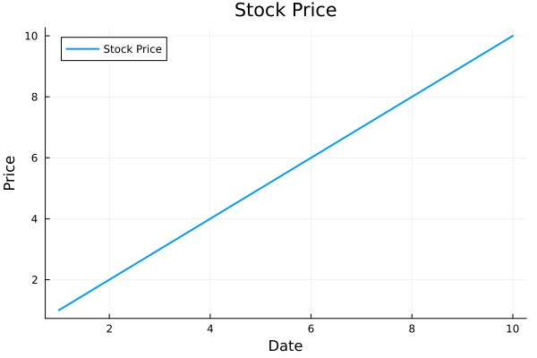

## A mini-funny Julia crash course for Python and R users

Hello, World!
I'm **Julia**. I'm like Python and R but I have my personality.

You can [run me online](https://julialang.org/learning/tryjulia/) to follow this tutorial if you haven't installed me already.


## Printing
I can print everything using ***print()*** or ***println()***
- ***print()***: prints on the same line
- ***println()***: adds a new line to the end of the output


```julia
println("Hello, I'm Julia")
```

```
## Hello, I'm Julia
```

```julia
println("I'm like like Python and R, but not quite")
```

```
## I'm like like Python and R, but not quite
```
## Package management

### Installing a package
I install new packages using:
- ***Pkg.add("package_name")***

```julia
using Pkg
#Pkg.add("DataFrames") 
```


### Adding a package to current session 
I add packages to my current session via ***using*** keyword:
- ***using package_name***

```julia
using Plots # similar to base R plot, matplotlib in Python
using Gadfly # similar to ggplot2, not similar to anything in python - this was never achieved in Python
using RDatasets # equivalent of rdatasets package
using DataFrames # similar to data.frame, data.table and dplyr in R, pandas in Python
using CSV # similar to read.csv, readr in R, pandas in Python
using Statistics # similar to base R, base Python
using Dates # similar to date in base R and datetime in python
```

## Vectors
I'm same as python


```julia
my_vector = [1, 2, 3, 4, 5]
```

```
## 5-element Vector{Int64}:
##  1
##  2
##  3
##  4
##  5
```


## Control Flow

### If statement
- I'm like Python but without **:**
- like R but w/o ugly ***{ }s***
- I must end with ***end***
- Unlike Python I don't need ***indentation*** but I prefer to have it.

```julia
if 5 > 0 
    println("Print me")
elseif 10 > 0 # - I have elseif in the middle, just like R
    println("Print me instead")
else
    println("Better to print me")
end
```

```
## Print me
```
### While loop
- I'm like Python but without **:**
- like R but w/o ugly ***{ }s***
- I must end with ***end***
- Unlike Python I don't need ***indentation*** but I prefer to have it.
- If I want to access a global variable inside of me I set ***global variable_name***.

```julia
x = 5;
while x > 0 
    global x
    println("Print me $x") 
    x -= 1
end 
```

```
## Print me 5
## Print me 4
## Print me 3
## Print me 2
## Print me 1
```

### For loop
- I'm like Python but without **:**
- like R but w/o ugly ***{ }s***
- I must end with ***end***
- Unlike Python I don't need ***indentation*** but I prefer to have it.

```julia
for i in 1:10 
    print(i, ",")
end
```

```
## 1,2,3,4,5,6,7,8,9,10,
```
## Functions
- I'm like R but w/o ugly ***{ }s***
- I must end with ***end***
- Unlike Python I don't need ***indentation*** but I prefer to have it.

```julia
function square_number(y)  
    return y^2
end
```

```
## square_number (generic function with 1 method)
```


### Calling a function
I'm just like R and Python

```julia
square_number(10)
```

```
## 100
```

### I'm Awesome!

```julia
square_number.([1,2,3,4,5]) # it will square each number in the vector
```

```
## 5-element Vector{Int64}:
##   1
##   4
##   9
##  16
##  25
```

## DataFrames
I'm like R and a bit of Python

```julia
df = DataFrame(Stock=["A", "B", "C", "D"], Price=1:4)
```

```
## 4×2 DataFrame
##  Row │ Stock   Price
##      │ String  Int64
## ─────┼───────────────
##    1 │ A           1
##    2 │ B           2
##    3 │ C           3
##    4 │ D           4
```
### Slicing DataFrames
I'm like R and Python but not quite. 
- I don't need annoying **loc** and **iloc** 
- I don't complain about copying.

```julia
df.Stock # all elements of Stock column
```

```
## 4-element Vector{String}:
##  "A"
##  "B"
##  "C"
##  "D"
```


```julia
df[:, "Stock"] # all rows of Stock column
```

```
## 4-element Vector{String}:
##  "A"
##  "B"
##  "C"
##  "D"
```


```julia
df[:, 2] # all rows of Price column
```

```
## 4-element Vector{Int64}:
##  1
##  2
##  3
##  4
```


```julia
df[1:3, :] # first 3 rows of each column
```

```
## 3×2 DataFrame
##  Row │ Stock   Price
##      │ String  Int64
## ─────┼───────────────
##    1 │ A           1
##    2 │ B           2
##    3 │ C           3
```


```julia
df[[begin, end], "Price"] # first and the last rows of Price column 
```

```
## 2-element Vector{Int64}:
##  1
##  4
```


```julia
df[[1,3], 2] # the first and the third rows of Price (2nd) column
```

```
## 2-element Vector{Int64}:
##  1
##  3
```


```julia
# Another DataFrame
stockPrices = DataFrame(
    Date = ["2022-01-31","2022-02-28","2022-03-31","2022-04-30","2022-05-31","2022-06-30","2022-07-31","2022-08-31","2022-09-30","2022-10-31","2022-11-30","2022-12-31",
    "2022-01-31","2022-02-28","2022-03-31","2022-04-30","2022-05-31","2022-06-30","2022-07-31","2022-08-31","2022-09-30","2022-10-31","2022-11-30","2022-12-31"],
    Stock=["TSLA","TSLA","TSLA","TSLA","TSLA", "TSLA","TSLA","TSLA","TSLA","TSLA","TSLA","TSLA",
    "NFLX","NFLX","NFLX","NFLX","NFLX","NFLX","NFLX","NFLX","NFLX","NFLX","NFLX","NFLX"],
    Price=[312.24,290.14,359.2,290.25,252.75,224.47,297.15,275.61,265.25,227.54,194.7,121.82,
    427.14,394.52,374.59,190.36,197.44,174.87,224.9,223.56,235.44,291.88,305.53,291.12]
)
```

```
## 24×3 DataFrame
##  Row │ Date        Stock   Price
##      │ String      String  Float64
## ─────┼─────────────────────────────
##    1 │ 2022-01-31  TSLA     312.24
##    2 │ 2022-02-28  TSLA     290.14
##    3 │ 2022-03-31  TSLA     359.2
##    4 │ 2022-04-30  TSLA     290.25
##    5 │ 2022-05-31  TSLA     252.75
##    6 │ 2022-06-30  TSLA     224.47
##    7 │ 2022-07-31  TSLA     297.15
##    8 │ 2022-08-31  TSLA     275.61
##   ⋮  │     ⋮         ⋮        ⋮
##   18 │ 2022-06-30  NFLX     174.87
##   19 │ 2022-07-31  NFLX     224.9
##   20 │ 2022-08-31  NFLX     223.56
##   21 │ 2022-09-30  NFLX     235.44
##   22 │ 2022-10-31  NFLX     291.88
##   23 │ 2022-11-30  NFLX     305.53
##   24 │ 2022-12-31  NFLX     291.12
##                      9 rows omitted
```
### Converting a ***String*** column to ***Date***
I have my own syntax. 

```julia
stockPrices.Date = Date.(stockPrices.Date, "yyyy-mm-dd")
```

```
## 24-element Vector{Date}:
##  2022-01-31
##  2022-02-28
##  2022-03-31
##  2022-04-30
##  2022-05-31
##  2022-06-30
##  2022-07-31
##  2022-08-31
##  2022-09-30
##  2022-10-31
##  ⋮
##  2022-04-30
##  2022-05-31
##  2022-06-30
##  2022-07-31
##  2022-08-31
##  2022-09-30
##  2022-10-31
##  2022-11-30
##  2022-12-31
```


```julia
### Frist 5 elements - I'm like R and Python but "first" instead of "head"
first(stockPrices, 5)
```

```
## 5×3 DataFrame
##  Row │ Date        Stock   Price
##      │ Date        String  Float64
## ─────┼─────────────────────────────
##    1 │ 2022-01-31  TSLA     312.24
##    2 │ 2022-02-28  TSLA     290.14
##    3 │ 2022-03-31  TSLA     359.2
##    4 │ 2022-04-30  TSLA     290.25
##    5 │ 2022-05-31  TSLA     252.75
```

```julia

### Last 5 elements - I'm like R and Python but "last" instead of "tail"
last(stockPrices, 5)
```

```
## 5×3 DataFrame
##  Row │ Date        Stock   Price
##      │ Date        String  Float64
## ─────┼─────────────────────────────
##    1 │ 2022-08-31  NFLX     223.56
##    2 │ 2022-09-30  NFLX     235.44
##    3 │ 2022-10-31  NFLX     291.88
##    4 │ 2022-11-30  NFLX     305.53
##    5 │ 2022-12-31  NFLX     291.12
```

## Importing and exporting data

### Writing a DataFrame to csv
I'm like R and Python but I have my own syntax. 
- I first accept ***filename.csv*** 
- and then DataFrame ***name***


```julia
CSV.write("stockPrices.csv", stockPrices)
```

```
## "stockPrices.csv"
```

### Reading data from csv as DataFrame
I am neither Python nor R.
- First ***import*** me 
- and then hug me with ***DataFrame()***

```julia
stockPrices = DataFrame(CSV.File("stockPrices.csv"))
```

```
## 24×3 DataFrame
##  Row │ Date        Stock    Price
##      │ Date        String7  Float64
## ─────┼──────────────────────────────
##    1 │ 2022-01-31  TSLA      312.24
##    2 │ 2022-02-28  TSLA      290.14
##    3 │ 2022-03-31  TSLA      359.2
##    4 │ 2022-04-30  TSLA      290.25
##    5 │ 2022-05-31  TSLA      252.75
##    6 │ 2022-06-30  TSLA      224.47
##    7 │ 2022-07-31  TSLA      297.15
##    8 │ 2022-08-31  TSLA      275.61
##   ⋮  │     ⋮          ⋮        ⋮
##   18 │ 2022-06-30  NFLX      174.87
##   19 │ 2022-07-31  NFLX      224.9
##   20 │ 2022-08-31  NFLX      223.56
##   21 │ 2022-09-30  NFLX      235.44
##   22 │ 2022-10-31  NFLX      291.88
##   23 │ 2022-11-30  NFLX      305.53
##   24 │ 2022-12-31  NFLX      291.12
##                       9 rows omitted
```


### Group by and combine
I have my own syntax for groupby. 
- I'm first ***grouping by*** 
- then ***combining***

```julia
grp = groupby(stockPrices, :Stock) 
```

```
## GroupedDataFrame with 2 groups based on key: Stock
## First Group (12 rows): Stock = "TSLA"
##  Row │ Date        Stock    Price
##      │ Date        String7  Float64
## ─────┼──────────────────────────────
##    1 │ 2022-01-31  TSLA      312.24
##    2 │ 2022-02-28  TSLA      290.14
##   ⋮  │     ⋮          ⋮        ⋮
##   11 │ 2022-11-30  TSLA      194.7
##   12 │ 2022-12-31  TSLA      121.82
##                       8 rows omitted
## ⋮
## Last Group (12 rows): Stock = "NFLX"
##  Row │ Date        Stock    Price
##      │ Date        String7  Float64
## ─────┼──────────────────────────────
##    1 │ 2022-01-31  NFLX      427.14
##    2 │ 2022-02-28  NFLX      394.52
##   ⋮  │     ⋮          ⋮        ⋮
##   12 │ 2022-12-31  NFLX      291.12
##                       9 rows omitted
```

```julia
avg_prices = combine(grp, :Price => mean)
```

```
## 2×2 DataFrame
##  Row │ Stock    Price_mean
##      │ String7  Float64
## ─────┼─────────────────────
##    1 │ TSLA        259.26
##    2 │ NFLX        277.613
```

### Filtering
- I'm way better than Python,
- but slightly uglier than R

```julia
filter(row -> row.Stock == "NFLX", stockPrices) # filter values for Netflix
```

```
## 12×3 DataFrame
##  Row │ Date        Stock    Price
##      │ Date        String7  Float64
## ─────┼──────────────────────────────
##    1 │ 2022-01-31  NFLX      427.14
##    2 │ 2022-02-28  NFLX      394.52
##    3 │ 2022-03-31  NFLX      374.59
##    4 │ 2022-04-30  NFLX      190.36
##    5 │ 2022-05-31  NFLX      197.44
##    6 │ 2022-06-30  NFLX      174.87
##    7 │ 2022-07-31  NFLX      224.9
##    8 │ 2022-08-31  NFLX      223.56
##    9 │ 2022-09-30  NFLX      235.44
##   10 │ 2022-10-31  NFLX      291.88
##   11 │ 2022-11-30  NFLX      305.53
##   12 │ 2022-12-31  NFLX      291.12
```


```julia
# you can use any name in place of row
filter(DonaldTrump -> DonaldTrump.Stock == "NFLX", stockPrices) # I will be gladly working as well
```

```
## 12×3 DataFrame
##  Row │ Date        Stock    Price
##      │ Date        String7  Float64
## ─────┼──────────────────────────────
##    1 │ 2022-01-31  NFLX      427.14
##    2 │ 2022-02-28  NFLX      394.52
##    3 │ 2022-03-31  NFLX      374.59
##    4 │ 2022-04-30  NFLX      190.36
##    5 │ 2022-05-31  NFLX      197.44
##    6 │ 2022-06-30  NFLX      174.87
##    7 │ 2022-07-31  NFLX      224.9
##    8 │ 2022-08-31  NFLX      223.56
##    9 │ 2022-09-30  NFLX      235.44
##   10 │ 2022-10-31  NFLX      291.88
##   11 │ 2022-11-30  NFLX      305.53
##   12 │ 2022-12-31  NFLX      291.12
```

## Plotting

### Plotting with *Plots.jl* 

- I'm similar to base plot in R, matplotlib in Python
- I'm way better than Python,
- and similar to R

```julia
Plots.plot(1:10, 1:10, label = "Stock Price", linewidth = 2, title = "Stock Price");
Plots.plot!(xlabel = "Date");
Plots.plot!(ylabel = "Price")
```

<!-- -->

### Plotting with *Gadfly.jl*
- I'm similar to ***ggplot2*** in **R**,
- **not similar to anything** in Python. **Python never succeeded in plotting**.
- I'm way way way better than Python,
- but less sophisticated than R.
- I know R is by far the best in Plotting
- but I'm doing my best to catch it.

```julia
Gadfly.plot(stockPrices, x=:Date, y=:Price, Geom.line, color = :Stock)
```

```
## Plot(...)
```


Check this out to learn why I was created in the first place:

[Why I was created](https://julialang.org/blog/2012/02/why-we-created-julia/)

[Learn more about me](https://julialang.org/)

[Download me from](https://julialang.org/downloads/)

[Read my (1.8) documentation](https://docs.julialang.org/en/v1/)

[Run me online](https://julialang.org/learning/tryjulia/)

